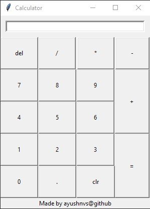

# Calculator

This calculator is designed by using Tkinter. Its executable is obtained by using Pyinstaller. It is located in calculator > dist.

### Screenshot

**Note:** It might still have few bugs.